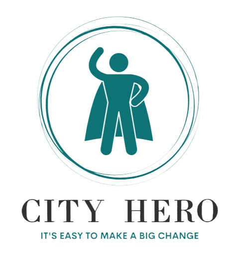
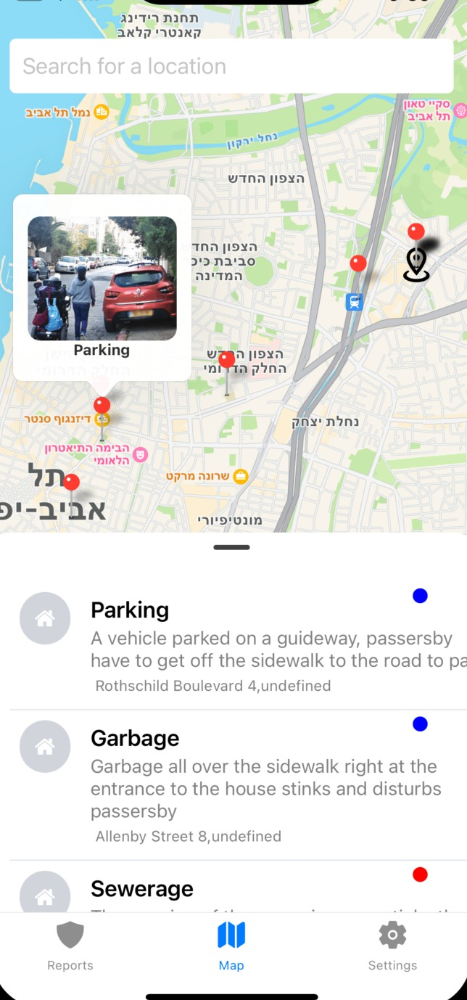
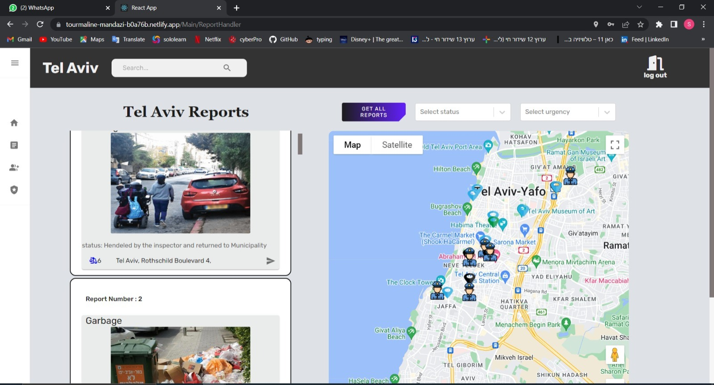

# city-hero

  <a href="#calling-general-info">General-info</a>&nbsp;&nbsp;&nbsp;|&nbsp;&nbsp;&nbsp;
  <a href="#eyes-preview">Preview</a>&nbsp;&nbsp;&nbsp;|&nbsp;&nbsp;&nbsp;
  <a href="#gear-core-tech-stack">Tech Stack</a>&nbsp;&nbsp;&nbsp;|&nbsp;&nbsp;&nbsp;
  <a href="#sparkles-main-features">Features</a>&nbsp;&nbsp;&nbsp;|&nbsp;&nbsp;&nbsp;
  <a href="#camera_flash-screenshots">Screenshots</a>&nbsp;&nbsp;&nbsp;|&nbsp;&nbsp;&nbsp;
  <a href="#memo-license-">License</a>&nbsp;&nbsp;&nbsp;|&nbsp;&nbsp;&nbsp;
  <a href="#warning-disclaimer">Disclaimer</a>

  

## :calling: General info

City-Hero is a full-stack project that aims to provide citizens with a platform to report city events directly to the municipality. The project consists of two React Native apps and a React website that work together to create a seamless user experience.

The two mobile apps are designed for both Android and iOS users, providing a convenient and accessible way for citizens to report issues such as street blockages, road damage, and other municipal problems. The apps have a user-friendly interface and provide the users with the ability to upload photos and add comments to their reports.

The React website provides a centralized location for all reports made by the citizens. It is accessible to the municipality officials and provides them with real-time data on the issues reported by the citizens. They can easily view the reports, their location, and status of the request, which allows them to take action accordingly.

One of the key features of City-Hero is the map functionality that allows the municipality officials to locate the reported issues and dispatch inspectors to the site. The map displays the location of all the inspectors, allowing the officials to assign an inspector closest to the site to quickly resolve the issue.

Overall, City-Hero is a comprehensive platform that provides a modern and innovative solution to address municipal issues. It has successfully bridged the gap between citizens and the municipality officials, creating a more efficient and effective system for problem-solving in the city.

## :eyes: Preview

### :1234: Instructions to Preview (_iOS users, see note below_)

1. Head over to the Google Play Store and download the Expo Go app

   - Link: https://play.google.com/store/apps/details?id=host.exp.exponent

2. Open the [Expo Go](https://play.google.com/store/apps/details?id=host.exp.exponent 'Expo Go') app or simply go to the [Expo website](https://expo.io/ 'Expo') and follow the instructions to register for an Expo account

   - Note: _**You will need an account on Expo in order to view the app!**_

3. After completing step 1 and 2 above, open your device camera and scan the provided QR code in the link below:

   - Link: https://expo.dev/@tommy2804/citizen && https://expo.dev/@tommy2804/inspector (_**Published version of app hosted on Expo**_)

4. After scanning the QR code, the Expo Go app will automatically load up the app

   - Note: _**If this is your first time opening the app, it might take a while to load up. Please be patient!**_

5. Enjoy! The app should be successfully loaded by now. Please feel free to play around and test out its features. If for any reason the app couldn't be loaded or any of the features are breaking, please report the issue at the link below.

   - Link: https://github.com/tommy2804/city-hero/issues

## :gear: Core Tech Stack

- :arrow_up_small:&nbsp; [Expo](https://expo.io/ 'Expo')
- 👷&nbsp; [React JS](https://react.dev/learn/start-a-new-react-project)
- :electron:&nbsp;[React Native](https://reactnative.dev/ 'React Native')
- :page_with_curl:&nbsp; [React Native Paper](https://callstack.github.io/react-native-paper/index.html 'React Native Paper')
- :link:&nbsp; [React Navigation](https://reactnavigation.org/ 'React Navigation')
- :performing_arts:&nbsp; [Styled Components](https://styled-components.com/ 'Styled Components')
- :fire:&nbsp; [MongoDB](https://www.mongodb.com/)
- :world_map:&nbsp; [Google Places APIs](https://developers.google.com/maps/documentation/places/web-service/overview 'Google Places APIs')

## :sparkles: Main Features

- Register & Login authentication through email & password.
- Location search through cities around the world to discover restaurants.
- Customizable report images utilizing mobile device camera with user permissions.
- Online report by citizens, with current location perrmitions to send currend data directly to the munciplity

## :camera_flash: Screenshots

<!-- Images -->

  
  
  

  
📊 <b>Videos</b>

https://user-images.githubusercontent.com/89460205/227721144-13a0958e-3272-4da0-bcc6-404eafe1005c.mp4

https://user-images.githubusercontent.com/89460205/227721139-5ff7970c-6c56-4038-a259-f56e691ed11b.mp4

  

## :memo: License 

This project is under the terms of the MIT license. For more information, please refer to the license [documentation](LICENSE.md).

## :warning: Disclaimer

The contents of these pages are provided as an information guide only. While every effort is made in preparing the material for publication, no responsibility is accepted by or on behalf of the owner(s) for any errors, omissions or misleading statements on these pages or any site to which these pages connect. Although every effort is made to ensure the reliability of listed sites this cannot be taken as an endorsement of these sites.
